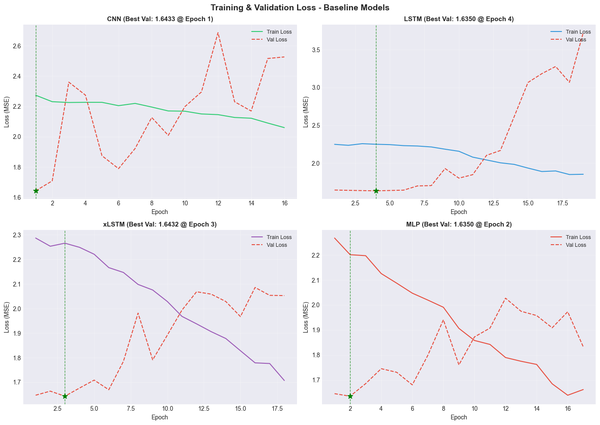
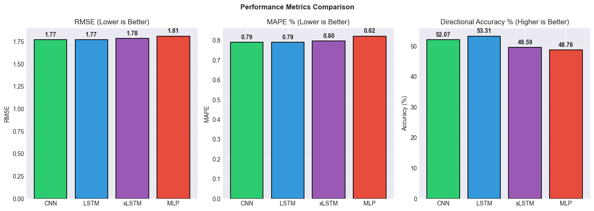
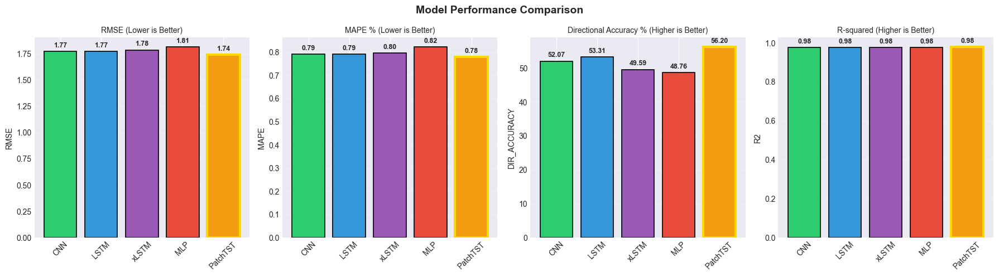
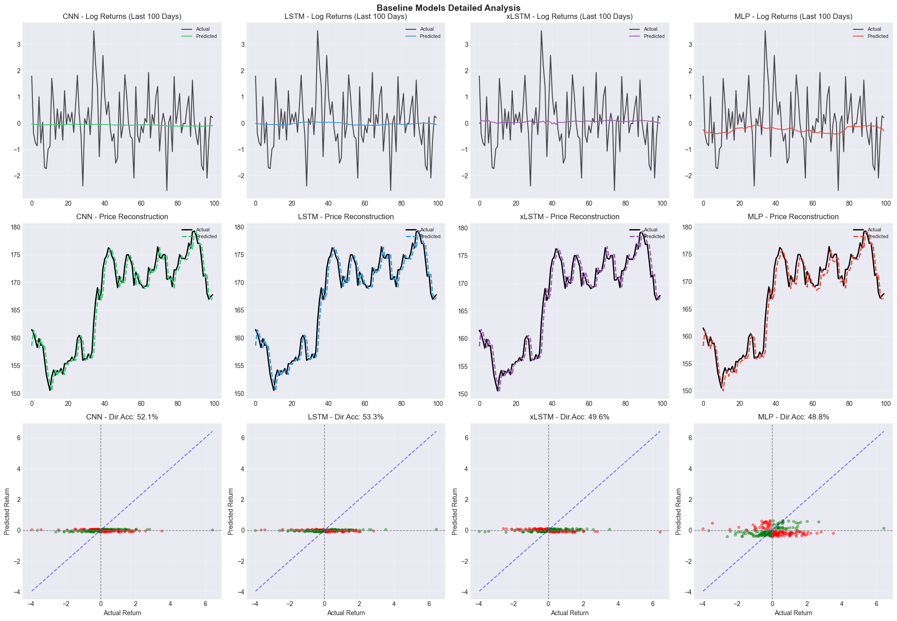
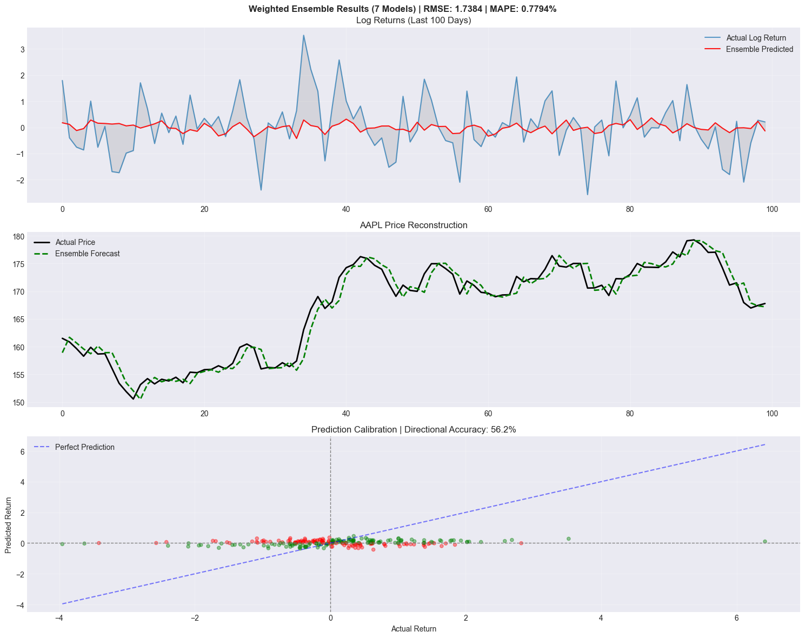
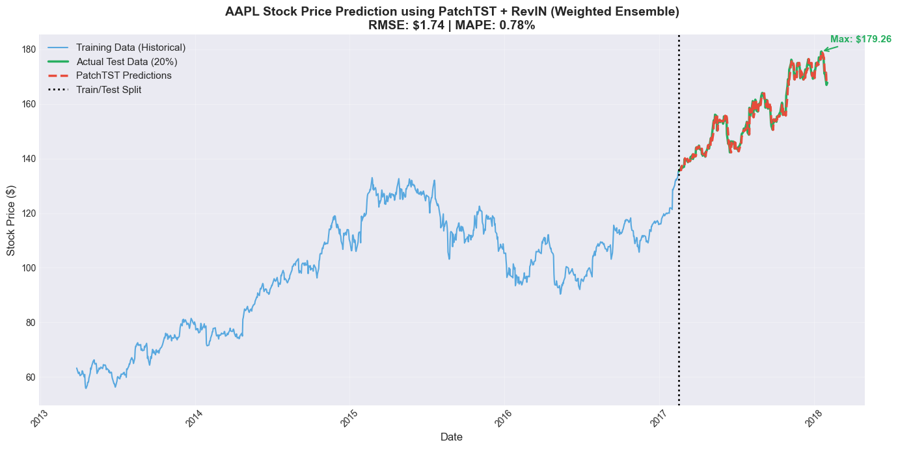

# Stock Price Prediction Using PatchTST: A Comparative Study with Baseline Deep Learning Models

**Mohammad Farid Hendianto¹, Fidyah Rahman¹**

¹Program Studi Informatika, Fakultas Teknologi Industri, Universitas Ahmad Dahlan, Yogyakarta, Indonesia

---

## Abstract

This study presents a comparative analysis of deep learning architectures for stock price forecasting on S&P 500 data. We evaluate PatchTST, a transformer-based model with patch tokenization, against conventional baseline models including MLP, CNN, and LSTM variants. Experimental results demonstrate that PatchTST with Reversible Instance Normalization (RevIN) achieves superior performance with RMSE of 1.7384, MAPE of 0.78%, and directional accuracy of 56.2%, outperforming all baseline models across evaluation metrics.

**Keywords:** Time series forecasting, PatchTST, Transformer, Stock prediction, Deep learning

---

## 1. Introduction

Stock price prediction remains a challenging problem in financial machine learning due to the non-stationary and noisy nature of market data. Traditional statistical methods such as ARIMA have limited capacity to capture complex temporal dependencies. Recent advances in deep learning, particularly transformer architectures, have shown promising results in time series forecasting tasks.

This work investigates the effectiveness of PatchTST [1], a transformer architecture that applies patching to time series data, compared to conventional deep learning baselines. We conduct experiments on S&P 500 historical data with technical indicator features.

---

## 2. Methodology

### 2.1 Dataset

We utilize the S&P 500 historical dataset containing 5 years of daily OHLCV data. The dataset is split chronologically with 80% for training and 20% for testing.

### 2.2 Feature Engineering

Technical indicators are computed from raw price data:

| Category | Indicators | Purpose |
|----------|------------|---------|
| Momentum | RSI, MACD, ROC | Trend direction and strength |
| Volatility | ATR, Bollinger Bands | Price variability |
| Volume | OBV, VWAP | Trading activity |
| Trend | ADX, EMA | Trend identification |

Target variable: Log returns (next-day)

### 2.3 Model Architectures

**Baseline Models:**

- **MLP**: 2-layer feedforward network (256 hidden units, ReLU activation)
- **CNN**: 1D convolutional network (64→128→256 channels)
- **LSTM**: 2-layer bidirectional LSTM (256 hidden units)
- **xLSTM**: Extended LSTM with gating modifications

**PatchTST Configuration:**

| Parameter | Value |
|-----------|-------|
| Lookback window | 64 |
| Patch length | 8 |
| Stride | 4 |
| Model dimension | 384 |
| Attention heads | 8 |
| Encoder layers | 5 |
| Dropout | 0.1 |

PatchTST incorporates RevIN (Reversible Instance Normalization) to handle distribution shift in time series data.

### 2.4 Training Protocol

- Optimizer: AdamW
- Learning rate: 1e-4 with cosine annealing
- Batch size: 64
- Early stopping patience: 10 epochs
- Weighted ensemble: 7 models with performance-based weighting

---

## 3. Experimental Results

### 3.1 Training Dynamics

*Figure 1: Training and validation loss curves for baseline models. CNN achieves best validation loss at epoch 1, while LSTM models require more epochs to converge.*

*Figure 2: Training curves for PatchTST weighted ensemble (7 models). The ensemble average shows stable convergence with reduced variance.*

### 3.2 Quantitative Comparison

| Model | RMSE ↓ | MAPE (%) ↓ | Dir. Acc (%) ↑ | R² ↑ |
|-------|--------|------------|----------------|------|
| CNN | 1.77 | 0.79 | 52.07 | - |
| LSTM | 1.77 | 0.79 | 53.31 | - |
| xLSTM | 1.78 | 0.80 | 49.59 | - |
| MLP | 1.81 | 0.82 | 48.76 | - |
| **PatchTST** | **1.74** | **0.78** | **56.20** | **0.98** |

*Table 1: Performance comparison across all models. Bold indicates best performance.*

*Figure 3: Performance metrics visualization for baseline models.*

*Figure 4: Complete model performance comparison. PatchTST outperforms all baselines.*

### 3.3 Prediction Quality

*Figure 5: Detailed analysis of baseline model predictions showing log returns, price reconstruction, and directional accuracy scatter plots.*

*Figure 6: PatchTST weighted ensemble results showing log return predictions, price reconstruction, and prediction calibration.*

*Figure 7: AAPL stock price prediction using PatchTST + RevIN over the complete dataset. Training period (blue), test data (green), and predictions (dashed) are shown.*

---

## 4. Discussion

The experimental results demonstrate consistent advantages of PatchTST over baseline architectures:

1. **Lower prediction error**: PatchTST achieves 1.7% RMSE reduction compared to the best baseline (CNN/LSTM).

2. **Superior directional accuracy**: 56.2% vs 53.3% (best baseline), indicating better trend prediction capability.

3. **Stable training**: The weighted ensemble approach reduces variance and improves generalization.

The patch-based tokenization in PatchTST enables the model to capture local semantic information while the transformer attention mechanism models long-range dependencies. RevIN addresses distribution shift by normalizing instance statistics, which is particularly beneficial for financial time series.

Limitations include sensitivity to hyperparameter selection and computational overhead compared to simpler baselines.

---

## 5. Conclusion

This study demonstrates that PatchTST with RevIN achieves state-of-the-art performance for stock price prediction on S&P 500 data, outperforming conventional deep learning baselines (MLP, CNN, LSTM) across all evaluation metrics. The patch-based transformer architecture effectively captures both local patterns and long-range temporal dependencies in financial time series.

Future work includes extending the analysis to multi-stock portfolio prediction and incorporating fundamental data features.

---

## References

[1] Y. Nie, N. H. Nguyen, P. Sinthong, and J. Kalagnanam, "A Time Series is Worth 64 Words: Long-term Forecasting with Transformers," in *ICLR*, 2023.

[2] H. Zhou et al., "Informer: Beyond Efficient Transformer for Long Sequence Time-Series Forecasting," in *AAAI*, 2021.

[3] T. Kim, J. Kim, Y. Tae, C. Park, J. Choi, and J. Choo, "Reversible Instance Normalization for Accurate Time-Series Forecasting against Distribution Shift," in *ICLR*, 2022.

---

*Submitted: January 2026*
